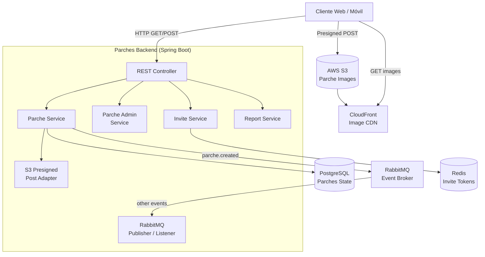
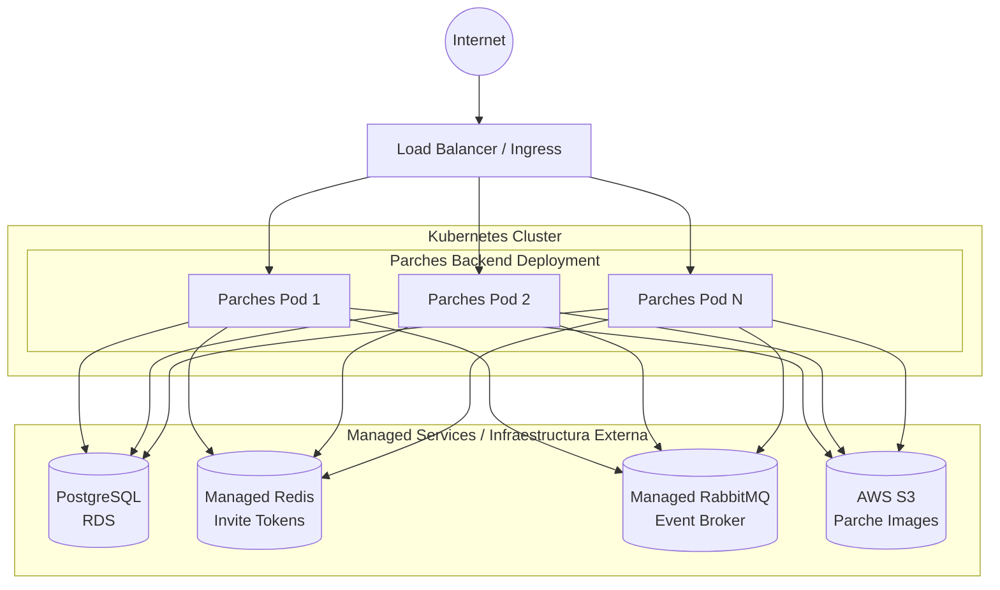

# Parches Backend Microservice

Este microservicio es la entidad central de negocio de la plataforma U-Link. Gestiona los "parches" (grupos sociales) que permiten a los usuarios organizarse, crear eventos, subir imágenes, invitar miembros, reportar comportamientos, y administrar grupos. Forma parte del ecosistema **PATRICIA** y es consumido por la mayoría de los demás microservicios.

## ¿Qué hace el microservicio?

1. **Gestión de Parches (Grupos):** Permite crear, actualizar, buscar y eliminar parches con visibilidad pública o privada. Cada parche tiene nombre, descripción, imagen de portada, y reglas de membresía.
2. **Sistema de Membresía:** Administra la entrada y salida de miembros, con flujos diferentes para unirse directamente (parches públicos) o ser invitado (parches privados). Implementa tokens de invitación únicos almacenados en Redis.
3. **Sistema de Administradores y Reportes:** Permite promover miembros a administradores, y reportar miembros por comportamiento inapropiado con descripción y clasificación del reporte.
4. **Vinculación con Eventos:** Los parches pueden tener eventos asociados, y el microservicio publica eventos de dominio cuando se crean parches nuevos para que otros servicios (Board, Communication, Parques) provisionen sus recursos correspondientes.
5. **Carga de Imágenes con S3:** Utiliza AWS S3 con URLs pre-firmadas (presigned POST) para permitir que los usuarios suban imágenes de portada de forma segura. Integra CloudFront para la entrega de imágenes.
6. **Integración Orientada a Eventos:** Emite eventos `parche.created` a través de RabbitMQ cuando se crea un nuevo parche, desencadenando la creación de tableros, canales de chat, y partidas de parques asociadas.

---

## Parámetros de Calidad y Principios de Diseño

* **Arquitectura Hexagonal (Puertos y Adaptadores):** El dominio está desacoplado de la infraestructura mediante puertos y adaptadores. La integración con S3/STS está encapsulada en adaptadores.
* **Principios SOLID:**
  * *Single Responsibility Principle (SRP):* Separación clara entre controladores (`ParcheController`), lógica de negocio (`ParcheService`, `ParcheAdminService`), invitaciones (`InviteService`), reportes (`ReportService`), y emisión de eventos.
  * *Dependency Inversion Principle (DIP):* Inyección de dependencias a través de constructores inyectados.
* **Alta Disponibilidad y Escalabilidad Horizontal:** PostgreSQL con Flyway para persistencia, Redis para tokens de invitación, RabbitMQ para eventos asíncronos.
* **Tolerancia a Fallos:** *Health Probes* (liveness, readiness) a través de Spring Boot Actuator.
* **Testing y Code Coverage:** *Coverage Gate* con JaCoCo (mínimo 80% en líneas), con tests de integración usando Testcontainers.

---

## Diagrama de Arquitectura



---

## Diagrama de Despliegue



## Tecnologías Principales

* Java 21
* Spring Boot 3.5.12
* Spring Web, Spring Data JPA
* Spring Data Redis
* Spring AMQP (RabbitMQ)
* Spring Boot Actuator
* PostgreSQL (AWS RDS)
* Flyway (Migrations)
* AWS SDK v2 (S3 Presigned POST + STS)
* Springdoc OpenAPI 2.8.9
* Testcontainers (Integration Tests)
* JaCoCo (Coverage)

## API Documentation

The service exposes a RESTful API documented via OpenAPI. Once the application is running, you can explore the API using the Swagger UI available at:
```
http://<HOST>:<PORT>/swagger-ui.html
```
The OpenAPI specification is generated automatically by Springdoc and can be accessed at `/v3/api-docs`.

## Running Locally

### Prerequisites
- Java 21 (or newer)
- Maven 3.9+
- Docker (optional, for containerized execution)
- Access to a PostgreSQL instance (local or remote)
- Access to a Redis instance (local or remote)
- Access to a RabbitMQ broker (local or remote)
- AWS credentials (for S3 presigned URLs)

### Steps
1. Clone the repository and navigate to the project root.
2. Set the required environment variables (see *Configuration* section below).
3. Build the project:
   ```
   ./mvnw clean package
   ```
4. Run the application:
   ```
   java -jar target/parches-0.0.1-SNAPSHOT.jar
   ```
   The service will start on port **8083** by default.

## Docker Deployment

A Dockerfile is provided for containerizing the microservice. Build and run the image with:
```bash
docker build -t parches-backend:latest .

docker run -d \
  -p 8083:8083 \
  -e "SPRING_PROFILES_ACTIVE=prod" \
  -e "SPRING_DATASOURCE_URL=jdbc:postgresql://postgres:5432/parches" \
  -e "SPRING_REDIS_HOST=redis" \
  -e "SPRING_RABBITMQ_HOST=rabbitmq" \
  -e "JWT_SECRET=your-secret-key" \
  -e "S3_BUCKET_NAME=your-bucket" \
  parches-backend:latest
```

A `docker-compose.yml` is also provided for local development with PostgreSQL, Redis, and RabbitMQ:
```bash
docker-compose up -d
```

## Configuration

The service requires the following environment variables:

| Variable | Description | Required |
|----------|-------------|----------|
| `JWT_SECRET` | Secret key for JWT validation | Yes |
| `SPRING_DATASOURCE_URL` | PostgreSQL JDBC URL | Yes |
| `SPRING_DATASOURCE_USERNAME` | PostgreSQL username | Yes |
| `SPRING_DATASOURCE_PASSWORD` | PostgreSQL password | Yes |
| `SPRING_REDIS_HOST` | Redis host for invite tokens | Yes |
| `SPRING_RABBITMQ_HOST` | RabbitMQ host for domain events | Yes |
| `SPRING_RABBITMQ_USERNAME` | RabbitMQ username | Yes |
| `SPRING_RABBITMQ_PASSWORD` | RabbitMQ password | Yes |
| `AWS_ACCESS_KEY_ID` | AWS access key for S3 | Yes |
| `AWS_SECRET_ACCESS_KEY` | AWS secret key for S3 | Yes |
| `S3_BUCKET_NAME` | S3 bucket for parche images | Yes |
| `S3_REGION` | AWS region for S3 | Yes |
| `CLOUDFRONT_URL` | CloudFront distribution URL for images | Yes |

## Testing

Unit and integration tests are located under `src/test/java`. Run the full test suite with:
```bash
./mvnw verify
```
Coverage is enforced by JaCoCo with a minimum of **80%** line coverage. Integration tests use Testcontainers for PostgreSQL and Redis.

## Contributing

Contributions are welcome! Please follow these steps:
1. Fork the repository.
2. Create a feature branch (`git checkout -b feature/awesome-feature`).
3. Implement your changes, ensuring existing tests pass and adding new tests if needed.
4. Submit a Pull Request with a clear description of the changes.

All contributions must adhere to the project's coding standards and pass the CI pipeline.

## License

This project is licensed under the **Apache License 2.0**. See the `LICENSE` file for details.
